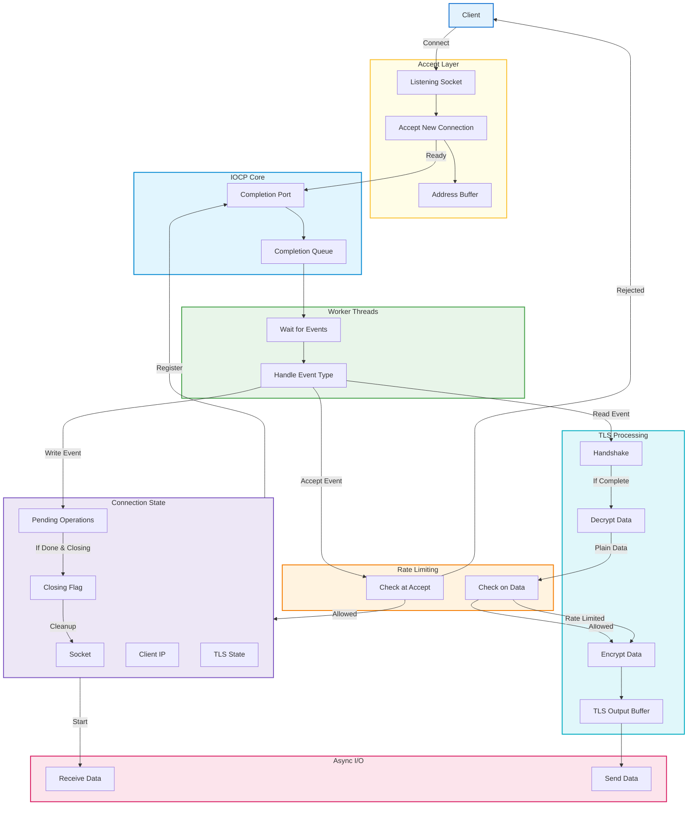

## reverse-proxy

An asynchronous, multi-threaded reverse proxy (for both Windows & Linux), designed to efficiently handle thousands of concurrent connections. Features include per-client rate limiting to mitigate application layer attacks and built-in TLS support (with session caching) for secure, high-performance communication.

## Features

- **Asynchronous I/O:** Uses IOCP (I/O Completion Ports) for scalable, non-blocking networking.
- **Multi-threaded:** Worker thread pool for efficient event handling.
- **TLS Termination:** Secure connections with OpenSSL, including session caching for fast resumption.
- **Per-client IP Rate Limiting:** Prevents abuse and application-layer attacks.
- **Load Balancing:** Intelligent request distribution across multiple backend servers with multiple algorithms (Round Robin, Least Connections, Weighted Round Robin, IP Hash, Random). Route-based pool management for different services.
- **Connection Management:** Robust handling of thousands of concurrent sockets.

### Workflow 1 - read from client and send to upstream
To achieve maximum network throughput without data corruption, the client-to-upstream data flow operates under a strict producer-consumer model with a single connection-specific mutex lock.
For each client connection, it is ensured that only at most one WSARecv call is pending at any time so that the data from client is processed in the same order as received. When data arrives, a single worker thread from the pool is awakened by IOCP. This thread performs the necessary application logic such as rate limiting and load balancing. Then, it acquires a lock to put data into the buffer and send it to upstream if no send if pending.
Once the send is completed, a thread is awakened which acquires the mutex, sets the isSendBusy (a boolean to track if any send to upstream is pending) to false, starts a new send, sets isSendBusy to true and releases the lock.
The mutex helps us to solve the producer-consumer problem by granting access of the buffer to only one thread.

#### Potential Deadlock Scenario and How this Architecture solves it
One important point to note from the workflow is that any update to the boolean flag ***isSendBusy*** must always occur after the thread has acquired the mutex. Without this the following situation can occur:
```
Thread A                                 Thread B
aquire mutex.lock()                      isSendBusy = false
     # critical section                  acquire mutex.lock()
     if (!isSendBusy):                    if (!buffer.empty()):
        copy to buffer                       post send
        post send                            isSendBusy = true
        isSendBusy = true                else:
     else:                                   do nothing 
        copy to buffer                   release mutex.lock()
release mutex.lock()
```
Consider that client just sent data (buffer is empty) and Thread B acquired the lock before Thread A. In the above scenario, due to CPU memory order operations, the isSendBusy = false might not complete until after the lock is released in Thread B. This means the thread B does nothing and releases the lock. But just before thread B sets isSendBusy to false, Thread A might acquire the lock and read the isSendBusy value (which is still True). Then, Thread A just copies to buffer and releases the lock. <p>
Now, the buffer has some data and isSendBusy is false, which means that only way the data in the buffer will be sent to upstream is if client sends data again and awakens Thread A logic. If not, the data remains in buffer and not get sent to upstream server and client keeps waiting for server's response to send new data. This results in a deadlock. <p>
Therefore, any update to the isSendBusy must occur after acquiring the lock and before realeasing as shown in the workflow diagram and as followed in the project.


### System Architecture And Workflow




**Starting the Proxy:**

```bash
make clean
```
```bash
make
```
```bash
./main.exe
```

## License

MIT License
