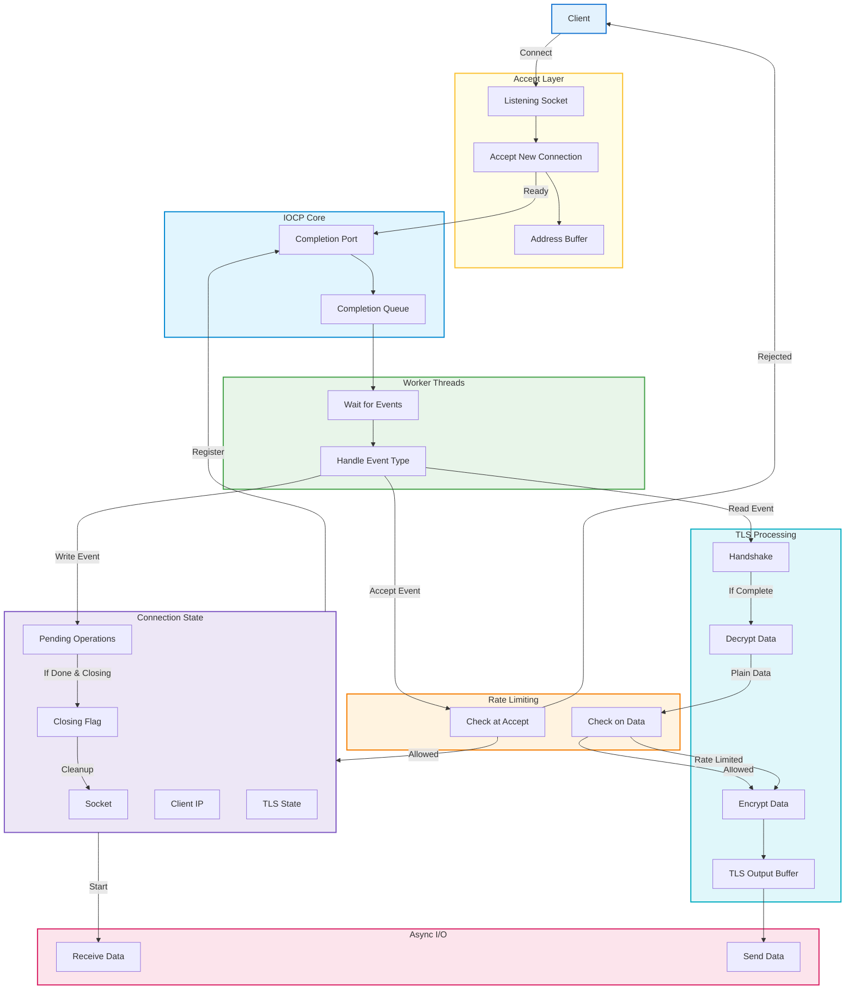

## reverse-proxy

An asynchronous, multi-threaded reverse proxy for Windows, designed to efficiently handle thousands of concurrent connections. Features include per-client rate limiting to mitigate application layer attacks and built-in TLS support (with session caching) for secure, high-performance communication.

## Features

- **Asynchronous I/O:** Uses IOCP (I/O Completion Ports) for scalable, non-blocking networking.
- **Multi-threaded:** Worker thread pool for efficient event handling.
- **TLS Termination:** Secure connections with OpenSSL, including session caching for fast resumption.
- **Per-client Rate Limiting:** Prevents abuse and application-layer attacks.
- **Connection Management:** Robust handling of thousands of concurrent sockets.


### System Architecture And Workflow




3. **Starting the Proxy:**

```bash
make clean
```
```bash
make
```
```bash
./main.exe
```

## License

MIT License
